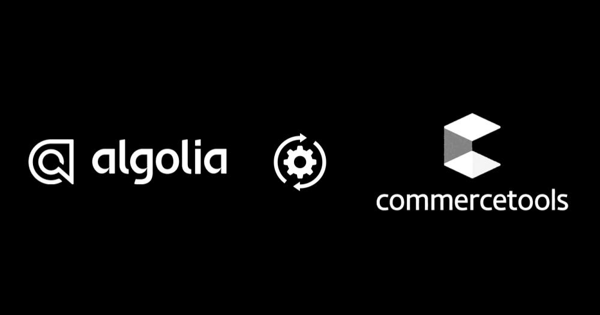

# Overview

This connector is designed to facilitate real-time synchronization of product data between CommerceTools and [Algolia](https://www.algolia.com/). It listens for changes (publish/unpublish) to product entities in CommerceTools and updates the Algolia index accordingly, ensuring that search results are always up to date.

**Key Features:**

1. Automatically updates Algolia index with new, modified, or deleted products in CommerceTools.
2. Customizable indexing configuration to tailor the search experience.
3. Secure integration with Algolia for efficient data handling.
4. Seamless integration with the CommerceTools platform to ensure data consistency.

Note: Currently, this application supports only product data synchronization and indexing within Algolia.

A [Merchant Center custom application](https://github.com/Ashsanpil/poc-merchant_center) with enhanced features for updating configurations, viewing analytics, accessing logs, and retrieving records.
